# C++ intermediate

## 1 . 面向对象编程

（object-Oriented Programming）

> - 面向过程：是一种以过程为中心的编程思想，不符合人的思维习惯，编程语言的重用性低、维护困难。
> - 面向对象：着眼点在于找到一个能够帮助解决问题的实体，然后委托这个实体来解决问题。

### 1.1 面向对象的三大特点：

> - 封装：把客观的事务封装成抽象的类，并且可以把自己的数据和方法只让可信的类或对象进行操作，对不可信的进行隐藏。类将成员变量和函数封装在类的内部，根据需要设置访问权限，通过成员函数内部管理状态。
> - 继承：表达的是类之间的关系，这种关系使得对象可以继承另外的一类对象的特征和能力。继承的作用：避免公用代码的重复的开发、减少代码的数据冗余。
> - 多态：多态性可以简单的概括为：“一个接口，多种方法”，即多种形态。程序在运行时才决定要调用的函数，它是==面向对象编程的核心。==

#### 案例分析

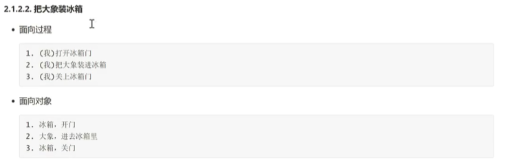

### 1.2 类与对象

（class and object)

在面向对象的思想中，**着眼点在于找到一个能够帮助解决问题的实体，然后委托这个实体解决问题。**

- **对象：**具有特定功能，能够解决特定问题的实体。
- **类：**由若干个具有相同特征和行为的对象组成的兑现的集合。

> 类是对象的集合；
>
> 对象是类的个体。
>
> 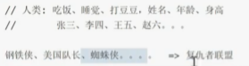

#### 1.2.1 类的设计和对象的创建

##### 1.2.1.1 类的设计

```cpp
// object_orientation_Basic.cpp : 此文件包含 "main" 函数。程序执行将在此处开始并结束。
#include <iostream>

using namespace std;

// 使用关键字 class来描述一个类
// 类：具有相同特征、功能对象的集合
// 类属性/特征： 用变量
// 类方法/行为： 用函数


// 访问权限
// 用来修饰属性、行为可以在什么位置可以访问
// private: 私有权限，只能在当前的类中访问，其他位置不可以访问。
// protected: 保护权限，类外不能访问，可以在当前类和子类访问。
// public:  公开权限，可以在任意位置访问。

// 注意事项：
// 类中定义的属性、方法，默认都是private私有权限的。
// 如果需要在类外访问，就修改其权限为public

class Person {
public:
	string name;
	int age;
	string gender;
	int score;

	void eat()
	{
		cout << "eat" << endl;
	}

	void sleep()
	{
		cout << "sleep" << endl;
	}

protected:
	int a;
};
```

##### 1.2.1.2 对象的创建

```cpp
	// 创建对象：
	// 从一个类中找到一个实体：实例化

	// 方式一：
	Person xiaoming = Person();
	// 方式二: 对象指针
	Person *xiaoli = new Person(); //new 在堆上创建
	//方式三：隐式调用
	Person xiaobai; // 等价与方法一

	// 如果类中是有属性的，所有的属性所占空间大小的和 就是 对象的空间大小。
	// 如果类中是没有属性的，对象所占的空间大小不是0Byte，而是1Byte，用来表示对象已经创建成功了。
	cout << sizeof(xiaoming) << endl;
```

|              | 使用new                | 没有使用new             |
| ------------ | ---------------------- | ----------------------- |
| ==内存开辟== | 在==堆空间==开辟       | 在==栈空间==上开辟      |
| 内存管理     | 需要手动delete         | 不需要手动销毁          |
| 属性初始化   | 自动有默认初始值       | 没有初始值              |
| 成员         | 需要用 **类 * **来接收 | 不需要使用 *****        |
| 成员访问     | 通过**.** 来访问 | 通过**->** 来访问 |
| 使用场景     | 大型项目               | 中小项目                |
|              | 被多个模块使用         | 没有多个模块的调用      |

> - 如果类中是有属性的，所有的**属性所占空间大小的和** 就是 **对象的空间大小。**
> - 如果类中是没有属性的，对象所占的空间大小不是0Byte，**而是1Byte，用来表示对象已经创建成功了**。

##### 1.2.1.3 成员访问

```cpp
	// 成员访问 : (包括 属性、函数）
	// 情况一：没有使用new创建对象，在栈上开辟
	// 使用 ”对象.方法/属性 “
	xiaoming.age = 20;
	xiaoming.gender = "male";
	xiaoming.name = "xiaoming";
	xiaoming.score = 100;

	//情况二： 使用new创建对象，在堆上开辟
	// 1.使用 ”对象 -> 方法/属性“
	// 2.(*对象).方法/属性
	xiaoli->name = "xiaoli";
	xiaoli->age = 18;
	(*xiaoli).gender = "female";
	(*xiaoli).score = 99;
```

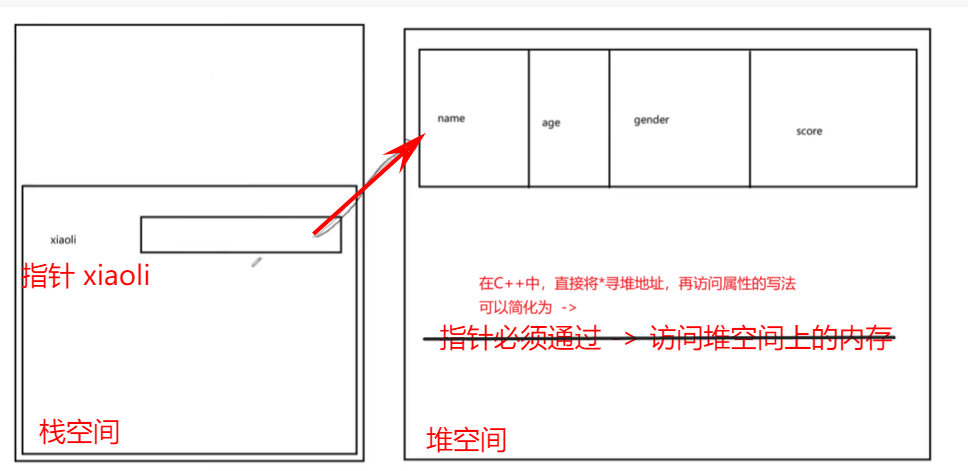

---

#### 1.2.2 类是一种自定义的数据类型

> A class is a C++ vehicle for translating an abstraction to a user-defined type.
>
> - 类是将抽象事务转换为用户定义类型的c++工具。

```cpp
#include <iostream>

using namespace std;

class Dog {
public:
	string name;
	int age;
};

class Person {
public:
	string name;
	int age;
	Dog pet;  // 等价于 Dog pet = Dog(); 以Dog作为Person的一个属性


	//在栈空间中创建一个对象指针，此时默认值为nullptr
	//需要注意空间问题
	Dog* otherPet;  

};

int main()
{
	//创建一个Person对象
	Person xiaoming;
	xiaoming.name = "xiaoming";
	xiaoming.age = 18;

	xiaoming.pet.name = "xiaobai";
	xiaoming.pet.age = 1;

	cout << xiaoming.name << endl;
	cout << xiaoming.pet.name << endl;

	//这里使用时，需要在堆空间上申请空间
	xiaoming.otherPet = new Dog();
	xiaoming.otherPet->name = "haha";
	xiaoming.otherPet->age = 2;

	cout << xiaoming.otherPet->name << endl;
	cout << xiaoming.otherPet->age << endl;

	system("pause");
	delete xiaoming.otherPet;

	return 0;
}
```

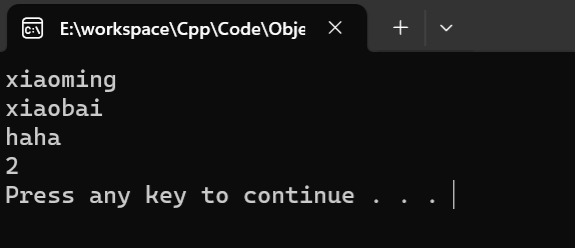

---

#### 1.2.3面向对象基础案例

##### 案例一

```cpp
#include <iostream>
using namespace std;

/*
面向对象基础案例：老师让学生做自我介绍

类：老师类、学生类
 
	学生：
		属性：名字、年龄、性别、成绩
		功能：自我介绍
	老师：
		属性：姓名
		功能：让学生做自我介绍
*/

class Student {
public:
	string name;
	int age;
	string gender;
	int score;

	void introduceSelf() {
		cout << "hello everyone, my name is " << name \
			<< ".  I'm " << age << " years old and a " << gender \
			<< ", my score is " << score << ", thanks." << endl;
	}
};

class Teacher{
public:
	string name;

	//让学生自我介绍，学生对象作为参数
	void makeIntroduce(Student s)
	{
		s.introduceSelf();
	}
};

int main()
{
	//创建学生对象
	Student xiaoming;
	xiaoming.age = 18;
	xiaoming.name = "xiaoming";
	xiaoming.gender = "boy";
	xiaoming.score = 90;

	//创建教师对象
	Teacher laowang;
	laowang.name = "laowang";

	//核心业务，老师让学生自我介绍
	laowang.makeIntroduce(xiaoming);

	return 0;
}
```

##### 案例二

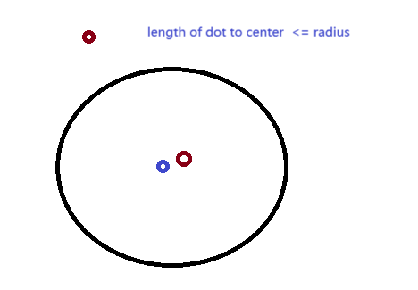

```cpp
#include <iostream>
using namespace std;

/*
面向对象基础案例二：判断一个圆是否包含一个点

类：圆、点

点类：
	属性：x，y
圆类
	属性：圆心、半径
	功能：判断是否包含一个点
*/

class Dot {
public:
	double x;
	double y;
};
class Circle {
public:
	Dot center;
	double radius;
	bool contain(Dot dot)
	{
		double dis = pow(center.x - dot.x, 2) + pow(center.y - dot.y, 2);
		//比较距离
		return dis <= pow(radius, 2);
	}
};
int main()
{
	Circle cir;
	Dot dot;
	cir.center.x = 0;
	cir.center.y = 0;
	cir.radius = 3;

	dot.x = 1;
	dot.y = 4;

	//核心业务，判断是否包含某个点
	cout <<  cir.contain(dot) << endl;

	return 0;
}
```

---

#### 1.2.4 在类外和其他文件中实现类函数

> - `.h`文件，一般是对外暴露、提供==公共函数==
> - `.cpp`文件，==公共 函数==的实现、==私有函数的定义==

---

### 1.3 静态 static

在类中定义成员的时候（函数、属性），可以用关键字 `static`来修饰，表示静态成员**【静态属性、静态函数】**

#### 1.3.1 静态属性

> - 静态的属性内存是开辟在**全局区**的，==与对象无关,不隶属于对象，而是被**所有对象所共享的**==，在**程序编译的时候**就完成了==空间的开辟==与==初始化操作==；生命周期为程序运行期间。
> - 如果希望某个属性是可以被所有对象所共享，则可以设置为静态属性。

#### 1.3.2 如何创建和初始化

> **Tip:**
>
> 1. 在类中定义的==静态变量成员==，必须在类内定义，在类外初始化赋值
>
> ```cpp
> class MyNumber {
> public:
> 	//在类中定义的静态成员，必须在类内定义，在类外初始化赋值
> 	static int a;
> };
> //在类外对静态成员，进行赋值
> //存储类型 类::静态成员 = 值
> int MyNumber::a = 100;
> ```
>
> ---
>
> 2. **如果**是==静态整形常量成员==【short,char,int,long,long long, bool 等】
>
>        或者是==静态函数成员== ,==允许在定义的时候初始化赋值==
>
>    **否则**，==任然需要在类外定义==。
>
> ```cpp
> class MyNumber {
> public:
> 	//如果是静态整形常量 【short,char,int,long,long long, bool 等】
> 	const static int PI = 1;
>     //静态函数成员
> 	static void show()
> 	{
> 		cout << "类中的静态函数调用了" << endl;
> 	}
>     // 允许在定义的时候初始化赋值 
>   
> 	// 否则，任然需要在类外定义
> 	const static float Exp;
> };
>
> //在类外对静态成员，进行赋值
>
> //限定符 存储类型 类::静态常量浮点型  = 值
> const float MyNumber::Exp = 0.001;
> ```

#### 1.3.3 如何访问静态成员

> 1. 使用==对象==来访问
>
> ```cpp
> 	//用对象来访问
> 	MyNumber number1;
> 	MyNumber number2;
>
> 	cout << number1.a << endl;
> 	cout << number2.a << endl;
> 	cout << number1.Exp << endl;
> ```
>
> 2. 使用==类==来访问【推荐】
>
> ```cpp
> 	//类来访问
> 	cout << MyNumber::a << endl;
> ```
>
> 3. 访问==静态函数==成员
>
> ```cpp
> 	//调用类中静态函数成员
> 	//方法一：
> 	MyNumber::show();  //【推荐】
> 	//方法二：
> 	number1.show();
> ```

#### 1.3.5 总结：

> - ==所有类共享 -> 设置静态==
> - ==某个类特有 -> 设置非静态==
> - 静态函数 ： 一般用来作工具类，直接使用，方便快捷。
> - 大多数情况下，都还是设置非静态的。

### 1.4 构造与析构函数

- 对象的生命周期
- 构造函数： 对象生命周期==开始==的地方
- 析构函数：对象生命==结束==的地方

#### 1.4.1  构造函数(constructors)

> 特殊的函数，在使用类的对象时，要为其分配空间，然后对创建的属性进行==初始化赋值==，这个过程就在**构造函数中完成**。

##### 1.4.1.1 构造函数的定义

> - 构造函数的名字，==必须和类的名字相同！==
> - 构造函数==不能写返回值类型！！==
> - 构造函数可以有==不同的重载 (overload) ！！！==
>
> ```cpp
> class Person {
> public:
>     //无参构造函数
>     Person() {
>         cout << "无参构造函数执行了" << endl;
>     }
>     //有参构造函数
>     Person(int age){
>         cout << "带age参数的构造函数执行了，age:" << age << endl;
>     }
>     //重载构造函数
>     Person(int age, int score) {
>         cout << "带age、socre的重载构造函数执行了，age：" << age << "score: " << score << endl;
>     }
>
> };
> ```

##### 1.4.1.2 构造函数的调用

###### 1️⃣  显式调用

> ```cpp
> // --------显式调用
> //构造函数的调用：创建对象的时候调用
>     Person xiaoming = Person();
>     Person xiaobai = Person(20);
>     Person xiaoli = Person(20, 99);
> ```
>
> ==【缩写形式】==
>
> - 注意： ==无参情况，缩写不能带()==，系统可能会认为在定义函数。
>
> ```cpp
> // --------显式调用
> 	Person xiaoming; //无参情况，不带()
>     Person xiaobai(20);
>     Person xiaoli(20, 99);
> ```
>
> 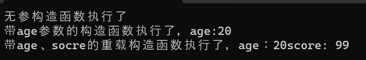

###### 2️⃣  隐式调用

> 直接将所有参数写在**大括号**中，系统会自动根据实参的数量和类型，找到与之匹配的构造函数。
>
> ```cpp
> // --------隐式调用
>     // 无参
>     Person xiaoli = {};
>     //有一个参
>     Person xiaoming = 10; //如果，大括号中只有一个参数，可以不写大括号
>     //有两个参
>     Person xiaobai = { 10,20 };
> ```

###### 3️⃣显式调用 之 ==实例化==

**在堆上创建对象 (new) -- 实例化 **

> ```cpp
> // -------- 显式调用之堆创建
>     Person* xiaoming = new Person();  //无参，小括号可以不写
>     Person* xiaoli = new Person(10);
>     Person* xiaobai = new Person(10, 20);
> ```

##### 1.4.1.3 explicit 关键字

> - adj. 清楚明白的，明确的，详述的；直截了当的，坦率的；赤裸裸表现性爱（或暴力）的，露骨的
> - n. （手稿、早期印刷品或礼拜仪式上唱诗的）结束语

> 1. 用来修饰构造函数，在构造函数之前
> 2. 表示无法通过==隐式调用==构造函数

```cpp
class Person {
public:
    //无参构造函数
    explicit Person() {
        cout << "无参构造函数执行了" << endl;
    }
    //有参构造函数
    Person(int age){
        cout << "带age参数的构造函数执行了，age:" << age << endl;
    }
    //重载构造函数
    Person(int age, int score) {
        cout << "带age、socre的重载构造函数执行了，age：" << age << "score: " << score << endl;
    }

};
```

##### 1.4.1.4 构造函数使用注意事项

> 1. 如果没有在一个类中写任何构造函数，那么系统将会==自动添加一个public权限无参构造函数==，可以让我们创建对象。
> 2. 如果给一个类写了构造函数了，此时系统将不再提供任何默认的构造函数。
> 3. 如果已经为一个类中==写了有参的构造函数==，一般会==同时补上无参构造函数==，否则 **缩写无参显式构造情况 “不带() ”**的情况 程序将报错。
>
> 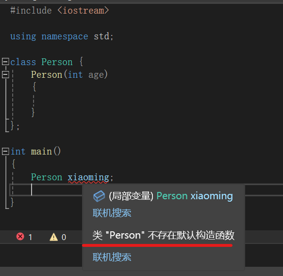

##### 1.4.1.5 初始化构造函数列表

==为了在创建对象时，对属性初始化赋值操作==

###### 方式一：直接赋值

> ```cpp
> class Person {
> public:
> 	string name;
> 	int age;
> 	string gender;
> 	int score;
> //方式一：直接赋值
> //无参构造函数
> Person() {
> 	name = "";
> 	age = 0;
> 	gender = "";
> 	score = 0;
> 	}
> //有参构造
> Person(string n,int a, string g,int s) {
> 	name = n;
> 	age = a;
> 	gender = g;
> 	score = s;
> 	}
> }；
> ```

###### 方式二: 构造函数初始化列表

> ```cpp
> //方式二：构造函数初始化列表
> //无参
> Person() : name(" "),age(0),gender(" "),score(0){}
> //有参
> Person(string n,int a, string g,int s):name(n),age(a),gender(g),score(s){ }
> 	//如果出现形参的名字与属性的名字相同的情况，系统会自动识别参数和属性
> Person(string name,int age,string gender):name(name),age(age),gender(gender){ }
> ```

##### 1.4.1.6 拷贝构造函数

###### ==C++构造函数的分类：==

> 1. 按照参数分：有参拷贝、无参拷贝
> 2. 按照类型分：普通构造、拷贝构造

###### ==拷贝构造==

> - 根据一个对象，拷贝出另外一个对象，新的对象与原来的对象**地址不同**，但是**属性值相同**。
> - 这个操作是在拷贝构造函数中完成！
> - 系统会自动提供拷贝构造函数，也可以自定义。
>
> ```cpp
> #include <iostream>
>
> using namespace std;
>
> class Person {
> public:
> 	string name;
> 	int age;
> 	string gender;
> 	int score;
>
> 	//方式二：构造函数列表
> 	//无参
> 	Person() : name(" "), age(0), gender(" "), score(0) {}
> 	//有参
> 	Person(string n, int a, string g, int s) :name(n), age(a), gender(g), score(s) { }
>
> 	//自定义拷贝构造函数
>     //这里也可以使用【直接赋值】的方法定义
> 	Person(const Person& p) : name(p.name),age(p.age+1),gender(p.gender),score(p.score) {
> 		cout << "拷贝构造函数调用了" << endl;
> 	}
> };
>
> int main()
> {
> 	//创建对象
> 	Person xiaoming("xiaoming", 19, "male", 99);
> 	//拷贝构造
> 		//相当于创建了一个新的对象，两者有着不同的空间，但有着相同的属性值
> 		//这个过程是自动调用【拷贝构造函数】
> 	Person xiaohei = xiaoming; //隐式调用 Person xiaohei = Person(xiaoming)
> 	//属性初始化
> 	cout << xiaoming.age << endl;
> 	cout << xiaohei.age << endl;
>
> }
> ```
>
> 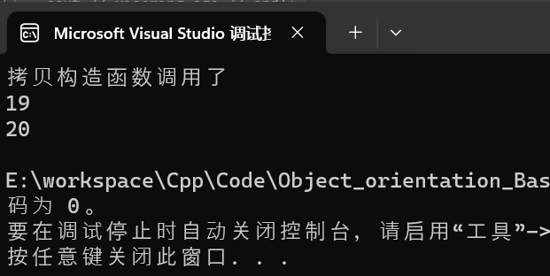

#### 1.4.2 析构函数(destructors)

> - ==对象生命周期的终点==，在对象被销毁之前调用
> - 在析构函数中，一般进行资源的释放，==堆内存的销毁==

###### 案例：内存泄漏！！！

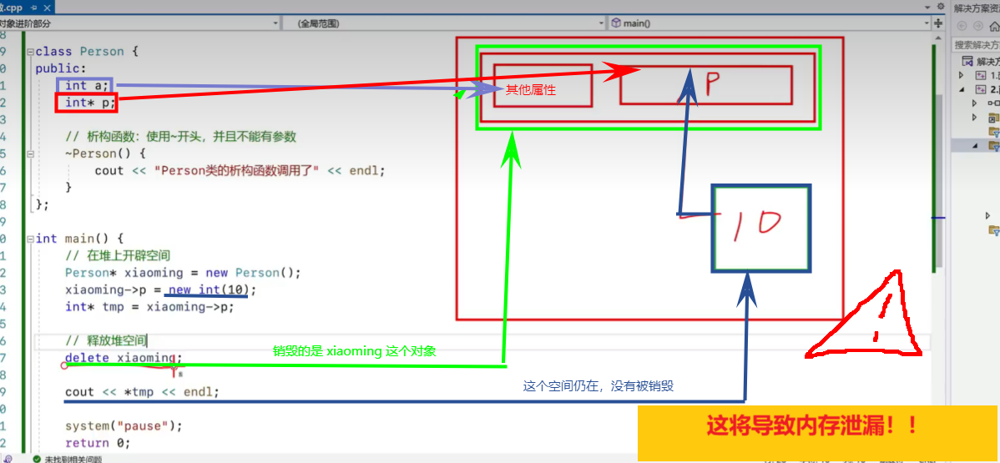

###### 解决方案: 在析构函数中销毁 ` int* p`

```cpp
#include <iostream>

using namespace std;

class Person {
public:
	string name;
	int age;
	string gender;
  
	int score;
	int* p; //注意这个
  
	//方式二：构造函数列表
	//无参
	Person() : name(" "), age(0), gender(" "), score(0) {}
	//有参
	Person(string n, int a, string g, int s) :name(n), age(a), gender(g), score(s) { }

	//自定义拷贝构造函数
	Person(const Person& p) : name(p.name), age(p.age + 1), gender(p.gender), score(p.score) {
		cout << "拷贝构造函数调用了" << endl;
	}

	//析构函数： 使用~开头，并且不能有参数
	~Person(){
		cout << "析构函数调用了" << endl;
		if (p != nullptr) {
			delete p;
			cout << "清除 int* p了" << endl;
			//防止野指针
			p = nullptr;
		}
	}
};

void test()
{
	Person person;
}

int main()
{
	//栈
	//test()函数是在栈上开辟的，调用完成就会销毁
	//就会触发析构
	test();

	//堆内存
	Person* xiaoming = new Person();
	xiaoming->p = new int(10);
	int* tmp = xiaoming->p;
	//手动释放堆空间
	//这里不会销毁 xiaoming->p ，如果析构函数中没有delete，会导致内存泄漏！！！
	delete xiaoming;

	cout << *tmp << endl;
	system("pause");
	return 0;
}
```

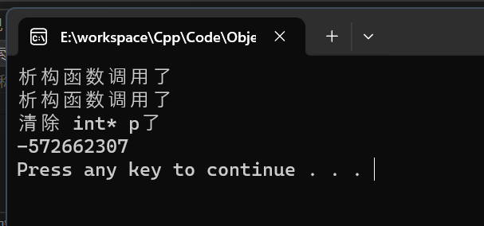

---

#### 1.4.3 深拷贝和浅拷贝：

> - 浅拷贝：在拷贝构造函数中，直接完成属性的值的拷贝操作。（默认的情况）
> - 深拷贝：在拷贝构造函数中，创建出来的新的空间，是属性中的指针指向的是一个新的空间。（需要自己定义)

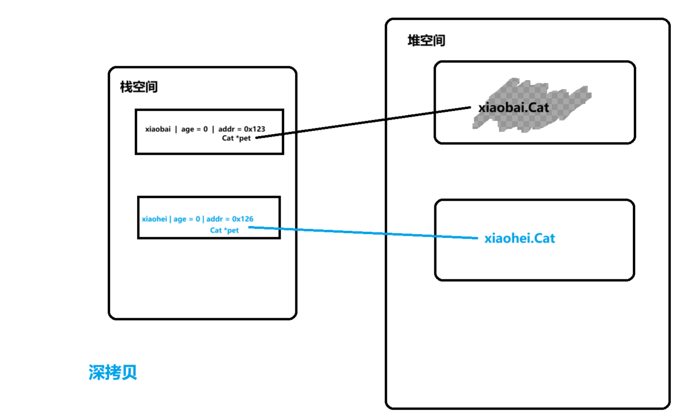

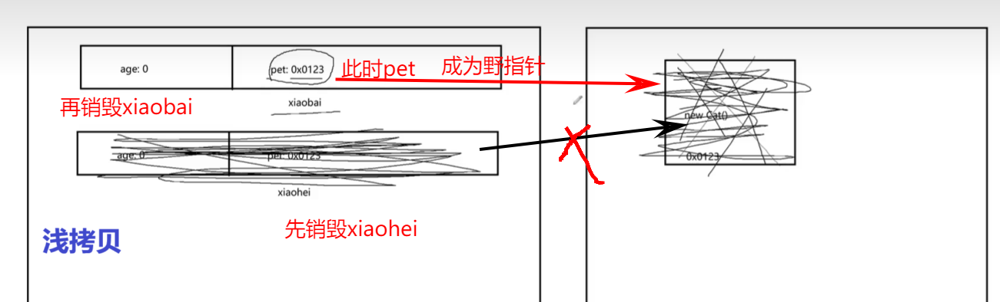

> ```cpp
> #include <iostream>
> using namespace std;
>
> class Cat {
> public:
> 	string name;
> 	int age;
> };
> class Person {
> public:
> 	int age;
> 	Cat* pet;
>
> 	Person() {
> 		age = 0;
> 		pet = new Cat();
> 		cout << "默认,构造函数调用了" << endl;
> 	}
> 	//拷贝构造函数
> 	//【浅拷贝】
> 	//Person(const Person& p)
> 	//{
> 	//	//默认即浅拷贝【值拷贝】
> 	//	age = p.age;
> 	//	pet = p.pet;
> 	//}
> 	//【深拷贝】
> 	Person(const Person& p) {
> 		age = p.age;
> 		//这里再new一个Cat出来，给xiaohei
> 		pet = new Cat();
> 		cout << "new Cat给拷贝的对象了" << endl;
> 		pet->name = p.pet->name;
> 		pet->age = p.pet->age;
> 		cout << "将对象的值赋值过去了" << endl;
> 	}
> 	//析构函数
> 	~Person() {
> 		if(pet != nullptr){
> 			delete pet;
> 			//防止出现野指针的情况
> 			pet = nullptr;
> 			cout << "销毁new出来的Cat了" << endl;
> 		}
> 	}
> };
> int main()
> {
> 	//
> 	Person xiaobai;
> 	Person xiaohei = xiaobai;
> 	//析构函数先销毁xiaohei 、 再销毁xiaobai
> 	return 0;
> }
> ```
>
> 

---

### 1.5 this指针：

> - this 是一个指针，用来指向==当前对象==的！
> - 当前对象：**谁调用这个函数，this就指向谁**。

> - 理论上来讲，在类的内部，访问当前类中的（非静态）成员的时候，都可以使用this->来访问。
> - 实际上，**绝大多数的情况下**，th1s->都是**可以省略不写**的。

#### 1.5.1 this指针的使用

> ==【注意】==this在某一个函数中出现==局部变量【参数】与属性名相同==，这个时候就需要用this->显式访问。

```cpp
#include <iostream>
using namespace std;

class Person {
public:
	int age;

	//构造函数
	Person() :age(0) { }
	Person(int age) {
		//这里出现了局部变量和属性同名的情况
		//直接使用名字访问，是局部变量
		//需要访问属性age，那就必须使用this->来显式访问
		this->age = age;
	}

	int getAge() {
		return this->age;
	}
};

int main()
{
	Person xiaoming(10);
	cout << xiaoming.getAge() << endl;

	Person xiaobai(20);
	cout << xiaobai.getAge() << endl;
	  
	return 0;
}
```

#### 1.5.2 this 指针 可以 ==【返回对象本身】==

```cpp
#include <iostream>

using namespace std;

//this:设计函数，返回对象本身

class MyNumber {
private:
	int n;

public:
	MyNumber():n(0){ }
	MyNumber(int n):n(n){ }

	//添加功能
	void display() {
		cout << n << endl;
	}

	//设计一个函数，累加上一个数字，返回对象本身
	//返回值：引用类自己
	//如果
	MyNumber& add(int n) {
		this->n += n;
		//this装载的地址是对象的首地址
		return *this;
	}
	//累减
	MyNumber& minus(int n) {
		this->n -= n;
		return *this;
	}
};


int main()
{
	MyNumber n;
	//函数的调用返回就是n自己，所以可以一直调用
    //链式调用/流式操作
	n.add(10).add(1).minus(6).add(1).display();

	return 0;
}
```

#### 1.5.3 空指针访问成员函数

> 1. 访问属性
>
> 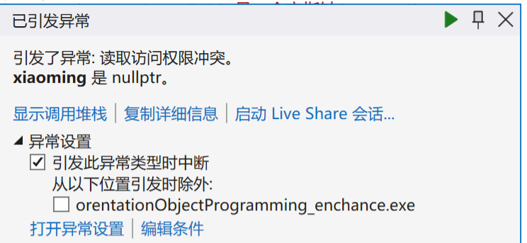
>
> 出现访问异常，因为this是空指针，没有创建空间，所以无法访问成员属性。
>
> ---
>
> 2. 访问方法
>
> ```cpp
> //使用空指针，调用成员函数
> class Person {
> public:
> 	int age;
>
> 	Person():age(0){}
>
> 	Person(int age) : age(age){}
>
> 	void func1(){
> 		cout << "func1执行了" << endl;
> 	}
>
> 	void func2()
> 	{
> 		if (this == nullptr) {
> 			cout << "this是一个空指针" << endl;
> 			return;
> 		}
> 		//在类中进行成员访问时，默认是访问成员的属性
> 		cout << age << endl;//省略了this->age
> 		cout << "func2执行了" << endl;
> 	}
> };
> int main()
> {
> 	//调用方法
> 	xiaoming->func1();
> 	xiaoming->func2();
> 	return 0;
> }
> ```
>
> 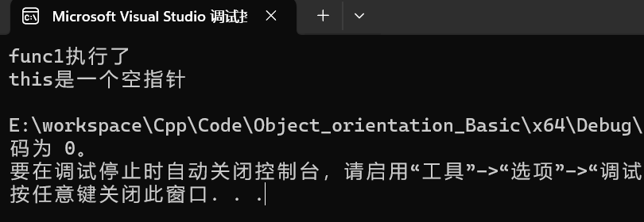

> 在c++中可以使用空指针访问==成员函数==，但是要保证这个函数不能出现this进行==空间访问==
>
> 因为**this已经==nullptr**

---

#### 1.5.4 常函数与常对象

> const 可以修饰类中的成员函数，表示这个函数是一个“常函数”

##### 1.常函数

```cpp
void fixPerson(string newNme,int newAge,int newScore) const{
    //不能修改属性值
    //只能读取属性值
}
```

> 1.使用关键之const来修饰函数。
>
> 2.在常函数中，不允许修改属性值；可以被外部调用。
>
> 3.常函数中，不允许普通函数，只能调用其他的常函数。

---

##### 2.常对象

```cpp
//定义一个常对象
const Person xiaobai("xiaobai",19,99);
```

> 1.创建对象的时候，使用const来修饰对象。
>
> 2.常对象可以==读取任意属性的值==，但是==不允许修改==。
>
> 3.常对象只能调用常函数，不能调用普通函数。

应用：在一个对象中，只需要读取属性的值，但是不希望进行修改。

```cpp
#include <iostream>

using namespace std;

class Person {
private:
	string name;
	int age;
	int score;

public:
	Person() : name("xiaoming"),age(0),score(0){}
	Person(string name,int age,int score):name(name),age(age),score(score){}

	//常函数
	void  display() const {
		cout << "name= " << name << endl;
	}
};

int main() {
	//常对象
	const Person xiaoming; 
	//常对象只能调用常函数
	xiaoming.display();
}

```

##### 3.mutable关键字

> 1.用来修饰属性的，表示可变
>
> 2.被mutable修饰的属性，**可以在常函数中修改**，**也可以由常对象进行修改**。

```cpp
class Person {
private:
	string name;
	int age;
	//mutable关键字
	mutable int score;

public:
	Person() : name("xiaoming"),age(0),score(0){}
	Person(string name,int age,int score):name(name),age(age),score(score){}

	//常函数
	void  display() const {
		score = 20;
		cout << "name= " << name << ", score= "<<score << endl;
	}
};

int main() {
	//常对象
	const Person xiaoming; 
	//常对象只能调用常函数
	xiaoming.display();
}

```

### 1.6 友元

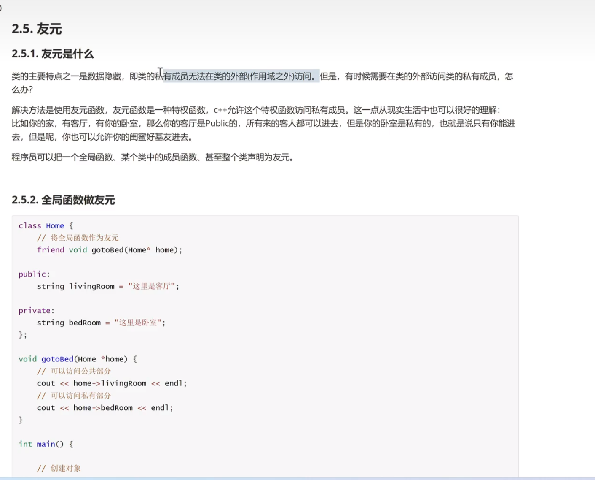

> 主要特点：==数据隐藏==【类的**私有成员**无法在类的外部（作用域之外）访问】
>
> - 但是，有时候需要**在类的外部访问类的私有成员**，这个时候就需要友元。

> 实现：使用友元函数。
>
> - 友元函数：是一种特权函数，C++允许该函数访问私有成员。
> - 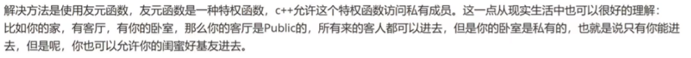

**程序员可以把一个全局函数、某个类中的成员函数、甚至整个类声明为友元。**

---

##### 1.全局函数作友元

```cpp
#include <iostream>

using namespace std;

//将全局函数做友元
class Home {

	//将一个全局函数声明为友元函数
	//必须要在类内声明
	friend void gotoBedRoom(Home* home);

public:
	string livingRoom = "客厅";

private:
	string bedRoom = "卧室";
};

void gotoBedRoom(Home* home)
{
	//可以访问public部分
	cout << home->livingRoom << endl;

    //通过友元函数的声明，就可以
	//访问private部分
	cout << home->bedRoom << endl;
}

int main()
{
	Home home;
	gotoBedRoom(&home);
	return 0;
}
```

---

##### 2.成员函数作友元

```cpp
#include <iostream>

using namespace std;

//将成员函数做友元

//提前声明此类
class Home;

class GoodFriend {
public:
	//要将Home类的声明 要在前，后面需要用到
	Home *home;
	void visitBedRoom();
};


class Home {
	//将GoodFriend中的成员函数声明为友元函数
	friend void GoodFriend::visitBedRoom();

public:
	string livingRoom = "客厅";

private:
	string bedRoom = "卧室";
};

//外部实现是为了能够访问Home类中后面声明出来的属性
void GoodFriend::visitBedRoom() {
	//访问public成员
	cout << home->livingRoom << endl;
	cout << home->bedRoom << endl;
}


int main() {
	////栈空间开辟home
	//Home home;
	//堆空间上开辟home
	Home *home = new Home();
	GoodFriend *goodfriend = new GoodFriend();
	//将外部开辟的home赋值给goodfriend中的home
	//goodfriend->home = &home;
	goodfriend->home = home;
	goodfriend->visitBedRoom();
	return 0;
}
```

---

##### 3.友元类【将类作友元】

**友元类中的==所有成员函数==都可以访问私有属性。**

```cpp
#include <iostream>
//将类作友元
using namespace std;

class Home {
	//声明类的友元
	friend class Friend;
public:
	string livingRoom = "客厅";
private:
	string bedRoom = "卧室";
};

class Friend {

public:
	//声明所调用的类
	Home* home;

	void gotoLivingRoom() {
		cout << "访问" << home->livingRoom << endl;
	}
	void gotoBedRoom() {
		cout << "访问" << home->bedRoom << endl;
	}
};

int main() {
	//创建堆
	Home* home = new Home();
	Friend *friend1 = new Friend();
	//赋值类
	friend1->home = home;
	//访问方法
	friend1->gotoBedRoom();
	friend1->gotoLivingRoom();
	return 0;
}
```

---

### 1.7 运算符重载

#### 1.简介

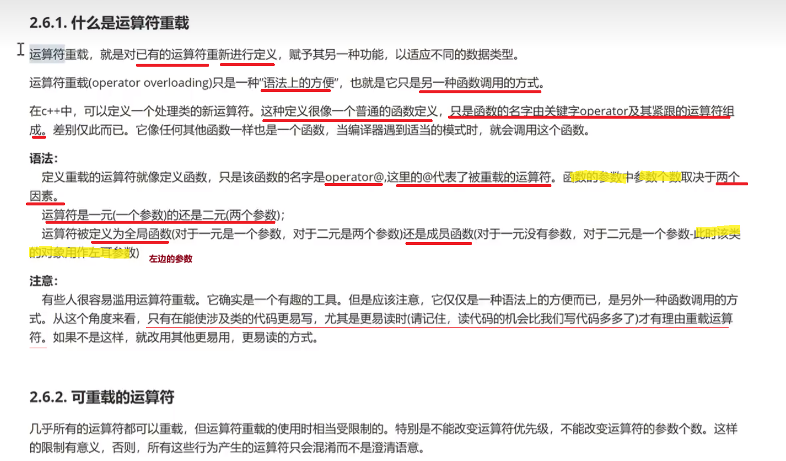

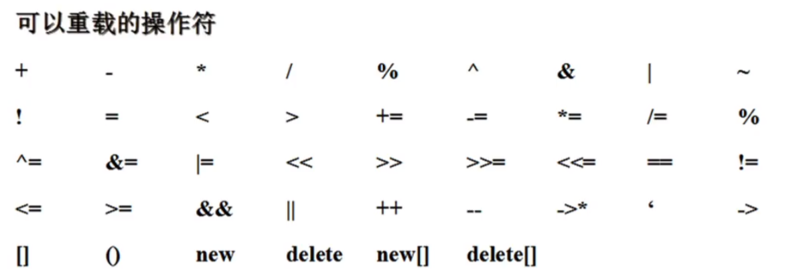

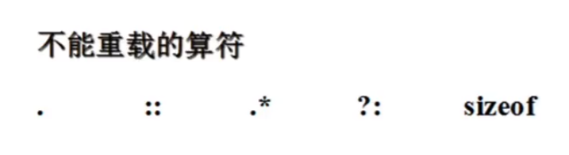

#### 2.类外定义重载

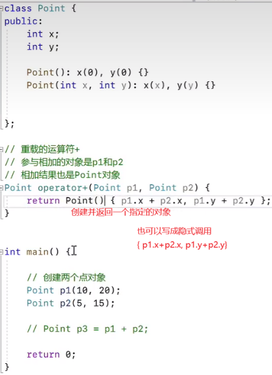

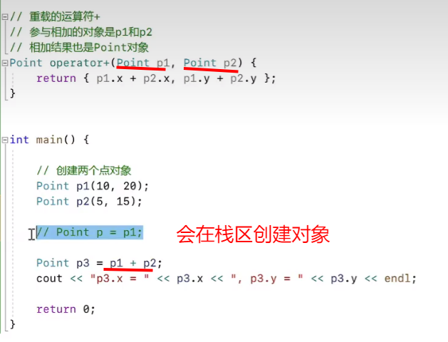

**会调用拷贝构造函数，频繁创建销毁空间，浪费内存**

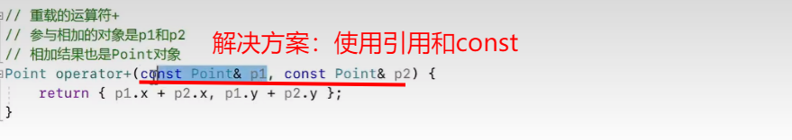

#### 3.类内定义重载

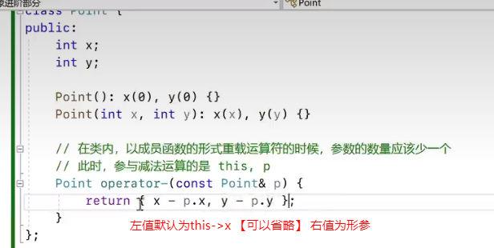

---

#### 4.++ 自增运算符重载

> 特别注意：由于编译器必须能够识别出前缀自增与后缀自增，人为规定用 operator++() 和 operator–() 重载前置运算符，用 operator++(int) 和 operator–(int) 重载后置运算符，在这里的 int 并没有什么实际的意义，仅仅是为了区分重载的是前置的形式还是后置的形式。

##### 类外定义

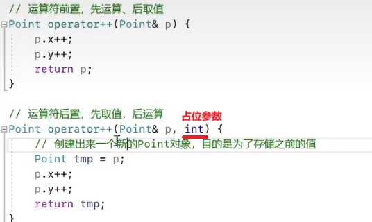

##### 类内定义

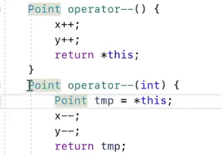

```cpp
#include <iostream>

using namespace std;
//新的数据类型类
class Point {
public:
	int x;
	int y;

	//构造函数
	Point() :x(0), y(0) {}
	Point(int x, int y) :x(x), y(y) {}

	//一元运算符的参数用this代替
	//--i
	Point operator--() {
		x--;
		y--;

		//返回这个类的值
		return *this;
	}

	//i--
	Point operator--(int) {
		Point tmp = *this; 
		x--;
		y--;
		return tmp;
	}
};


int main() {
	Point x(1, 2);
	Point y = --x;
	cout << y.x <<","<<y.y<<endl;
	return 0;
}

```

#### 5.=运算符重载

> 对象使用赋值运算符时，默认调用的是浅拷贝，需要对“=”进行重载，完成值拷贝【深拷贝】

```cpp
#include <iostream>

using namespace std;

class Person {
private:
	string name;
	int age;
	string gender;
	int* score;

public:
	friend ostream& operator<<(ostream& os, const Person& p);
	Person() :name(""), age(0), gender(""), score(nullptr) {}
	//int *p = new int(10);// p指向一个值为10的int数。
	Person(string name, int age, string gender, int score) : name(name), age(age), gender(gender), score(new int(score)) {}

	//深拷贝构造函数
	Person(const Person& p) {
		name = p.name;
		age = p.age;
		gender = p.gender;
		//score指针指向值为 *p.score , 新开辟空间
		score = new int(*p.score);
	}

	//=运算符重载函数
	Person& operator=(const Person& p) {
		name = p.name;
		age = p.age;
		gender = p.gender;
		score = new int(*p.score);
	}

	//析构函数，防止出现野指针的情况
	//对象销毁的时候，执行该函数
	~Person() {
		if (score != nullptr) {
			delete score;
			score = nullptr;
		}
	}
};

//运算符重载 <<函数
ostream& operator<<(ostream& os, const Person& p) {
	//字符串拼接
	os << "name=" << p.name << ", age= " << p.age << ", gender=" << p.gender << ", score= " << *p.score;
	return os;
}


int main() {
	Person xiaobai("xiaobai", 20, "female", 10);
	cout << xiaobai << endl;

	//浅拷贝，调用默认的拷贝构造函数【值拷贝】
	//一般浅拷贝中如果出现属性中需要开辟堆空间时，就会出现野指针的情况
	//在等号赋值运算中，也是默认调用浅拷贝函数，需要对 “=” 进行重载
	Person xiaohei = xiaobai;

	cout << xiaohei << endl;

	return 0;
}
```

---

### 1.8面向对象三大特性

> - 封装：将功能相近的类放入一个模块之中
> - 继承
> - 多态

#### 1.8.1 封装

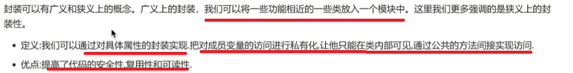

##### 侠义封装性

```cpp
#include <iostream>

using namespace std;


// 属性的封装：
// WHY: 因为有一些属性，不希望外界直接访问，特别是不想直接被修改。
// HOW: 属性私有化，并且提供指定的访问函数。
class Person {
private:
	string name;
	int age;

public://好处：1.
			//1.可以对传的参数进行限制
			//2.避免代码的复用性
			//3.提高代码的可读性

	//创建构造函数，进行属性初始化
	Person() :name(""),age(0){ }

	//创建访问函数
	int getAge() {
		return age;
	}
	//创建修改属性函数
	void setAge(int age) {
		//对传的参数进行限制
		if (age >= 0 && age <= 150) {
			this->age = age;
		}

	}
};

int main() {
	// 创建对象
	Person xiaobai;
	//// 属性赋值
	//xiaobai.name = "xiaobai";
	////这里的属性不希望被外部直接修改
	//xiaobai.age = -100000;
	// 属性赋值
	xiaobai.setAge(100);
	cout << xiaobai.getAge() << endl;


	return 0;
}
```

---

#### 1.8.2 继承

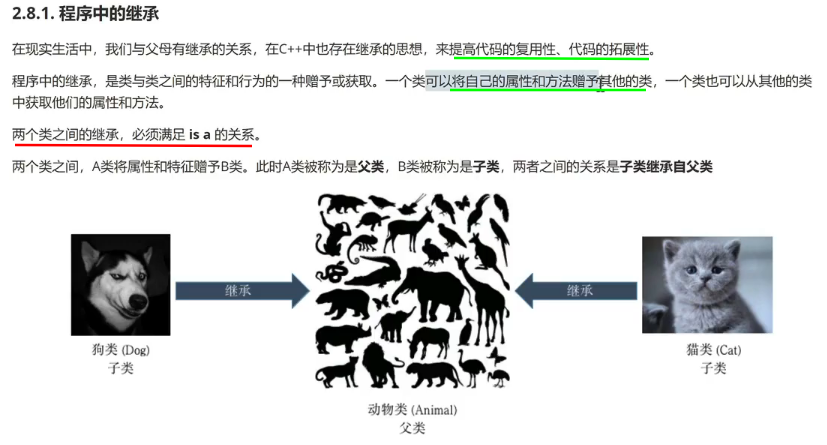

> 不同的说法：基类|超类（父类）、子类（派生类）

---

##### 继承的特点：

> 1. 父类中所有的非静态成员，都可以继承给子类（排除构造函数、析构函数）
> 2. 一个类中可以被多个类同时继承
> 3. 在C++中，一个类可以有多个父类（多继承）
> 4. 一个类在继承父类的同时，也可以被他的子类继承【链式继承】

---

##### 继承属性的访问权限：

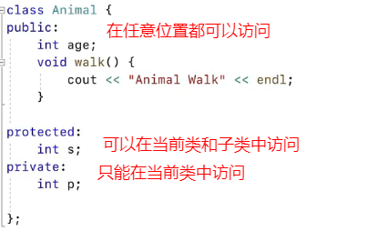

> **私有属性，也可以继承给子类**，==只不过在**子类中由于访问权限的限制**==，导致没有办法访问。

---

##### 继承的三种方式：

**不同的继承方式会影响基类成员在派生类中的访问权限。**

**1) public继承方式*** 基类中所有 public 成员在派生类中为 public 属性；

* 基类中所有 protected 成员在派生类中为 protected 属性；
* 基类中所有 private 成员在派生类中不能使用。

**2) protected继承方式*** 基类中的所有 public 成员在派生类中为 protected 属性；

* 基类中的所有 protected 成员在派生类中为 protected 属性；
* 基类中的所有 private 成员在派生类中不能使用。

**3) private继承方式*** 基类中的所有 public 成员在派生类中均为 private 属性；

* 基类中的所有 protected 成员在派生类中均为 private 属性；
* 基类中的所有 private 成员在派生类中不能使用。


**在C++中，默认使用私有继承**

---

```cpp
#include <iostream>

using namespace std;

class BaseClass {
public:
	int publicField;
protected:
	int protectedField;
private:
	int privateField;
};


class SubClass1 : public BaseClass{ 
	void test01() {
		cout << publicField << endl;
		cout << protectedField << endl;
		//无访问权限 cout << privateField << endl;
	}
	};
class SubClass2 : protected BaseClass { 
	void test02() {
		cout << publicField << endl;
		cout << protectedField << endl;
		//无访问权限 cout << privateField << endl;
	}
};
class SubClass3 : private BaseClass{
	void test03() {
		cout << publicField << endl;
		cout << protectedField << endl;
		//无访问权限 cout << privateField << endl;
	}
};


int main() {
	SubClass1 *s1 = new SubClass1;
	//s1 能访问public属性
	cout << s1->publicField << endl;

	SubClass2 s2;
	//s2 中public属性变成protected
	// 无访问权限 cout << s2->publicField << endl;

	SubClass3 s3;
	//s2 中所有属性变成private
}
```

---
