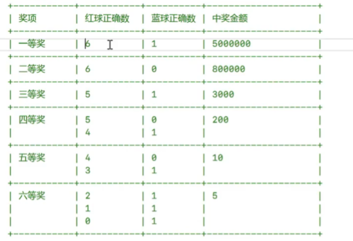

# C++ 初级

## 1.0 VS创建项目

### 解决方案

#### 解决方案--就是项目运行的环境


> 可以在同一个解决方案中创建多个项目

#### 切换项目运行


## 6.0 指针和引用

### 6.1内存分析

#### 6.1.1内存分区

> - 栈区
>
> - 堆区
>
> - 全局区（静态存储区）
> - 代码区

- 代码区

> 存放程序编译执行后生成的二进制代码，。
> PS：函数在程序编译后，存储于代码区，调用函数的时候，就会压栈执行对应的代码。

- 全局区

> 全局区内的变量在程序编译阶段已经分配号内存空间并初始化。
> ==这块内存在程序的整个运行期间都存在。==
> 主要存放==静态变量==、==全局变量==和==常量。==

```cpp
#include <iostream>
using namespace std;

//全局变量
int g_a = 10;
//全局常量
const int g_b = 10;
//全局静态变量
static int g_s_a = 10;
//全局静态常量
static const int g_s_b = 10;

int main()
{
    //定义局部__
	int a = 10;
	const int b = 10;
	static int s_a = 10;
	static const int s_b = 10;
    
	cout << &g_a << endl; //全局区
	cout << &g_b << endl;
	cout << &g_s_a << endl;
	cout << &g_s_b << endl;

	cout << &a << endl; //栈区
	cout << &b << endl; //栈区
    
	cout << &s_a << endl; //全局区
	cout << &s_b << endl;
	return 0;
}
```


- 栈区

> 由系统进行内存的管理，主要存放函数的参数以及局部变量。
>
> 在函数完成执行，系统自行释放内存，不需要用户管理。

- 堆区

> 由编程人员手动申请、释放，程序结束后由系统回收，生命周期是程序运行期间。

#### 6.1.2 内存中的数据残留

> “删除数据”  
>
> - 删除对指定范围空间的“使用权”，但是这块空间中原来的内容是不会被删除的。

```cpp
#include <iostream>
using namespace std;
int main()
{
	int a;
	//局部变量a是在栈中开辟，栈空间内存不需要我们手动管理，也不会进行初始化的操作。

	int* p = new(int);
	cout << "p = " << p << endl;
	//new表示在堆空间中开辟内存，同时会进行初始化操作，经这块内存中的原来的值给覆盖掉，初始化值为0。

	return 0;
} 
```

### 6.2 指针

#### 6.2.1 空指针

没有存储任何内存地址的指针变量，一般C++11中使用==nullptr==来表示一个空地址。

> nullptr 
>
> - 可以被隐式转换成任意的指针类型。
>
> - 解决了NULL的遗留问题【NULL本质上是int类型，值为0】
> - 详见 [C++11 nullptr：初始化空指针 (biancheng.net)](https://c.biancheng.net/view/7887.html)

#### 6.2.2 野指针

指针变量中确实存放了一个内存地址，但是这个地址指向的空间不存在了。

```cpp
int *p = (int *)0x1234;
cout << p <<endl;
cout << *p <<endl; //访问不了该地址的值
```

#### 6.2.3 常量指针和指针常量

##### 常量指针

一个指向常量的指针

> 特点：
>
> 1. 指针指向的==空间的值==是不允许修改的
> 2. 指针指向的==地址==是可以修改的
>
> > ```cpp
> > //指针常量
> > int* const p2 = &num1;
> > //p2 = &num2; //不可以修改指针的指向
> > *p2 = 30;
> > cout << "p2修改后的值为： " << *p2 << endl;
> > ```

##### 指针常量

指针本身是一个常量

> 特点：
>
> 1. 指针指向的==地址==是不能修改的
> 2. 指针指向的==空间的值==是可以修改的
>
> >```cpp
> >	//指针常量
> >	int* const p2 = &num1;
> >	//p2 = &num2; //不可以修改指针的指向
> >	*p2 = 30;
> >	cout << "p2修改后的值为： " << *p2 << endl;
> >```

#### 6.2.4 指针在函数中使用

```cpp
#include <iostream>

using namespace std;

void change(int* p) {
	cout << "num:" << *p << endl;
	cout << "inside:" << p << endl;
}
int main()
{
	int a = 10;
	change(&a);
	cout << "outside:" << &a << endl;
	return 0;
}
```


### 6.3 引用

引用可以作为一个已定变量的别名

> 基本用法：Type &ref = val;

> 注意事项：
>
> 1. & 在这里不是取地址，而是起标识作用
> 2. Type 类型标识符是指目标变量的类型
> 3. 必须==在声明引用变量时进行初始化==
> 4. 引用初始化之后==不能改变==
> 5. ==不能由NULL引用==。必须确保引用是和一块合法的存储单元关联
> 6. 可以建立对数组的引用

#### 6.3.1 引用的基础使用

```cpp
#include <iostream>

using namespace std;

int main()
{
	//定义一个整型的变量
	int num = 10;
	//定义一个引用，引用到num
	int& a = num;

	//比较值
	cout << "num = " << num << ",a = " << a << endl;

	//比较地址
	cout << "&num = " << &num << ", &a = " << &a << endl;
} 
```


#### 6.3.2 引用在函数中的使用

```cpp
//使用引用，对形参的修改，会影响实参
void swap(int& num1, int& num2)
{
	int temp = num1;
	num1 = num2;
	num2 = temp;
}
```

> 在函数中对形参的修改影响到实参：
>
> ==核心：传地址==
>
> 方法：引用、指针

#### 6.3.3 引用的本质

==一个指针常量==

```cpp
int main()
{
	int n = 10;

	int* const rn_1 = &n;
	//上面操作相当于 
	int& rn_2 = n;

	//在通过引用访问空间时，系统会自动转换成 rn = 20 ==> *rn = 20
	*rn_1 = 20;
	rn_2 = 20;

	cout << rn_1 << endl;
	cout << &rn_2 << endl;
}
```


#### 6.3.4 常量引用

> 就是对一个常量建立引用。
>
> 主要作用在函数的形参部分，==防止访问误操作导致在函数体中通过形参，修改实参的值==

```cpp
void change(const int& n)
{
    //不能对形参进行修改操作
    //n = 200;
    
    //只能进行访问操作
    cout << n <<endl;
}
```

## 7.0 数组

#### 7.1 浅拷贝和深拷贝

> - 浅拷贝：地址拷贝，拷贝到的时数组的首元素地址。
>
> - 深拷贝: 定义一个新的数组，长度与原来的数组相同，将原来数组的每一个元素依次拷贝到新的数组中。

```cpp
#include <iostream>
using namespace std;

int main()
{
	int array[] = { 0,1,2,3,4,5,6,7,8,9 };

	//浅拷贝、地址拷贝
	int* array_copy_1 = array;

	//深拷贝，创建一个新的等长的数组，将元素依次拷贝过来
	int array_deepcopy[10];
	for (int i=0; i < (sizeof(array) / sizeof(int)); i++)
	{
		array_deepcopy[i] = array[i];
		cout << array_deepcopy[i] << " ";
	}
	cout << endl;
	return 0;
}
```

## 8. 双色球项目

>**项目描述：**
>双色球一直都是大家喜闻乐见的娱乐行为，搏一搏，单车变摩托！
>(仅供娱乐，请勿沉迷)
>**双色球规则：**
>1、一注双色球由5个红球和1个蓝球组成
>2、红球的范围是[1,33]，且不能重复
>3、蓝球的范围是[1,16]
>4、展示的时候，红球在前，蓝球在后。并且红球部分需要进行升序排序
>5、展示的时候，红球与蓝球的数字不够两位的，需要往前补0凑够两位，例如01 02 03
>
>**项目需求：**
>1、完成基本的用户交互，可以让用户在控制台上进行自己的选择（自选号码、机选号码】
>2、完成用户自选号码的输入控制
>3、完成机选号码的实现（随机生成一注双色球，也可以用来生成中奖号码)
>
>4、完成用户选择的号码与中奖号码的展示
>5、完成奖项的判定与输出、中奖金额的判定与输出

### new int()和new int[]

```cpp
int *a = new int[7];
// 现在 a 是指向包含 7 个整数的数组的指针
// 你可以通过 a[0], a[1], ..., a[6] 访问数组的不同元素
delete[] a; // 记得在使用完数组后释放内存

```

```cpp
int *a = new int(7);
// 现在 a 是指向包含一个整数的内存块的指针
// 你可以通过 *a 访问这个整数
delete a; // 记得在使用完单个元素后释放内存
```

### 随机数

#### 1.随机数生成

```cpp
#include <iostream>
#include <time>

int getRandomNumber(int start, int end)
{
	return rand() % (end - start) + start;
}

int main()
{
    //time(0) 获取毫秒数
    //srand()播随机数种子
    srand(time(0));

  	for (int i = 0; i < 10; i++)
	{
		cout << getRandomNumber(10,20)<<endl;
	}
        
     return 0;
}
```

#### 2.机选号码数组生成实现


#### 总结

- 养成封装的习惯
- 函数功能模块尽量保证功能的单一性
